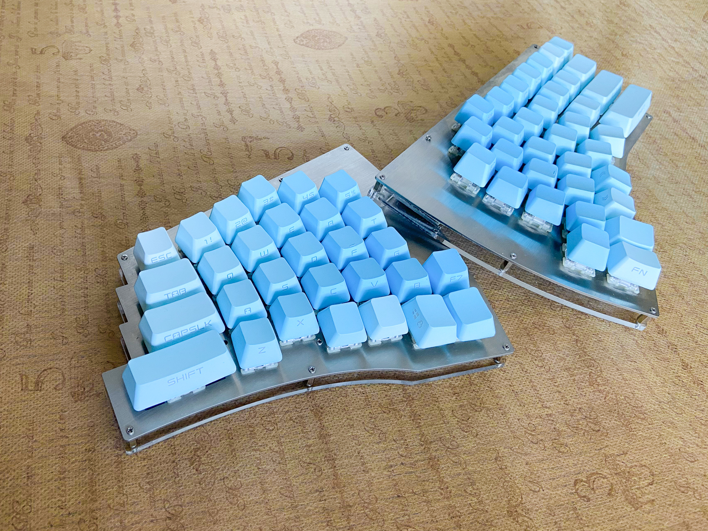

# willow64-doc

## Willow64キーボードについて

Willow64は手指の自然な動きに優しくフィットするキー配列が特徴の、左右分離型の自作キーボードです。

Willow64の紹介記事 - [自作キーボード Willow 64を作った話](https://coal.hatenablog.com/entry/2020/12/04/231923)

  

## ビルドガイド

 [Willow64 ビルドガイド](buildguide-willow64-r2.md)  

## QMKファームウェア

#### GitHub
  
  https://github.com/hanachi-ap/qmk_firmware/tree/willow64

#### QMK Firmware バイナリファイル

  - [デフォルトキーマップ (VIA対応)](https://github.com/hanachi-ap/willow64-doc/releases/download/rev2.3.1/willow_willow64_via_default.hex)

    -  [デフォルトキーマップの説明](./default-keymap.md)

  - [テスト用キーマップ](https://github.com/hanachi-ap/willow64-doc/releases/download/rev2.3.1/willow_willow64_buildtest.hex)

  - [作者常用のキーマップ](https://github.com/hanachi-ap/willow64-doc/releases/download/rev2.3.1/willow_willow64_via_hanachi.hex)

#### VIA jsonファイル

  - [VIA-wllow64.json](https://github.com/hanachi-ap/willow64-doc/releases/download/rev2.3.1/VIA_keymap_wllow64.json)

VIA対応のファームウェアを利用すると、GUIを使ってキーマップを簡単に変更できるようになります。
VIAの利用方法は下記の記事が参考になります。
   
  - [（初心者編）VIAを使ってキーマップを書き換えよう](https://salicylic-acid3.hatenablog.com/entry/via-manual) (サリチル酸さん)

## Willow配列

Willow配列は自作キーボードコミュニティの発展のため自由に利用、改変していただけます。

 [Willow配列のPDF](https://github.com/hanachi-ap/willow64-doc/blob/main/img/willow_layout_v1.pdf)  (CC BY-SA 4.0 by Hanachi.)

