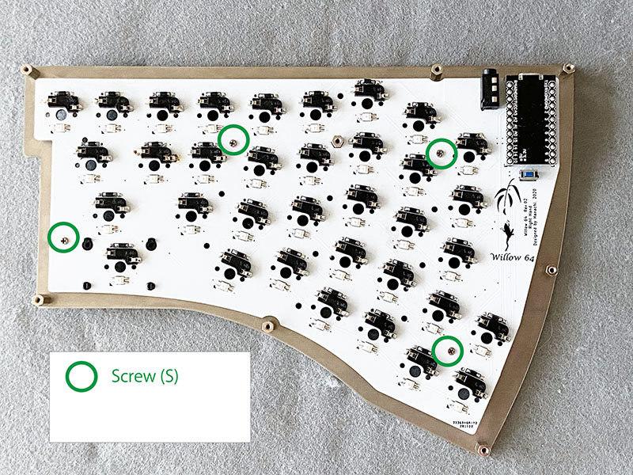

# Willow64 keyboard ビルドガイド

#### TOC

- [Willow64 keyboard ビルドガイド](#willow64-keyboard-ビルドガイド)
      - [TOC](#toc)
  - [はじめに](#はじめに)
      - [想定するユーザスキル](#想定するユーザスキル)
      - [このドキュメントでは言及しない内容](#このドキュメントでは言及しない内容)
  - [1.組み立て前の準備](#1組み立て前の準備)
    - [組み立てキット内容物](#組み立てキット内容物)
    - [組み立てキット以外に必要な部品](#組み立てキット以外に必要な部品)
      - [必ず必要な部品](#必ず必要な部品)
      - [必要に応じて揃える部品](#必要に応じて揃える部品)
    - [組み立てに必要なツール](#組み立てに必要なツール)
      - [必要なツール](#必要なツール)
      - [お好みに応じて用意するツール](#お好みに応じて用意するツール)
    - [ファームウェア書き込み環境の準備](#ファームウェア書き込み環境の準備)
      - [QMK Toolboxのダウンロードとインストール](#qmk-toolboxのダウンロードとインストール)
      - [Willow64用のファームウェアをダウンロード](#willow64用のファームウェアをダウンロード)
  - [組み立て手順](#組み立て手順)
    - [1.ProMicroのUSBコネクタ周辺の補強(オプション)](#1promicroのusbコネクタ周辺の補強オプション)
    - [2.ProMicroの取り付け](#2promicroの取り付け)
    - [3.TRRSジャックの取り付け](#3trrsジャックの取り付け)
    - [4.リセットスイッチの取り付け](#4リセットスイッチの取り付け)
    - [5.動作確認用ファームウェアの書き込み](#5動作確認用ファームウェアの書き込み)
    - [6.LEDのはんだ付け(オプション)](#6ledのはんだ付けオプション)
    - [7.ダイオードのはんだ付け](#7ダイオードのはんだ付け)
    - [8.スイッチソケットのはんだ付け](#8スイッチソケットのはんだ付け)
    - [9.キーの動作確認](#9キーの動作確認)
    - [10.スタビライザーの取り付け(Option)](#10スタビライザーの取り付けoption)
    - [11.ケースの組み立て](#11ケースの組み立て)
  - [2.キースイッチの取り付け](#2キースイッチの取り付け)
    - [13.キーキャップの取り付け](#13キーキャップの取り付け)
    - [14.本稼働用のファームウェアの書き込み](#14本稼働用のファームウェアの書き込み)
    - [以上で組み立ては完了です。お疲れさまでした](#以上で組み立ては完了ですお疲れさまでした)
  - [トラブル時の対処](#トラブル時の対処)
  - [参考情報](#参考情報)
    - [キーボードパーツショップ(日本)](#キーボードパーツショップ日本)
    - [はんだ付け技能](#はんだ付け技能)

## はじめに

本ドキュメントはWillow64を組み立てるための手順について記しています。


  > 対象機種:  Willow64 Assemly kit (PCB Rev.2.3  model SPA-2  スプリングピンヘッダ対応版)

  - 本キーボードの組み立て及び利用にはWindows PCもしくはMacが必要です。
      - このビルドガイドではWindows10を想定していますがMacについてもほとんど同じですので読み替えてください。

  - 本組み立てキットは、はんだ付けの工程が必要です。
     - 表面実装タイプの部品を取り扱う箇所があるため 組み立て難易度としてはやや高い部類になります。
    - はんだ付けについての様々な情報やテクニックについては本書末尾にまとめていますので、必要に応じて参照してください。

  - このドキュメントでは言及しない内容

    - はんだ付けの具体的な方法、関連技術など (必要に応じて末尾で紹介するサイトなどを参照してください)
    - キーマップのカスタマイズ方法 
    - QMK Firmwareの概要、導入、ビルド、コーディング方法
    - VIAの使い方
    - git、GitHubの使い方
    - キーボードの動作原理


## 1.組み立て前の準備
組み立てを始める前に、本章の内容を確認し準備が十分に整っていることを確認してから次に進んでください。

### 組み立てキット内容物
パッケージを開けたら、まず内容物が正しく揃っているかを確認します。

- PCB (プリント基板)  (右手 1個、左手 1個)

  電子部品を取り付けるプレートです。 左右で形状が異なります。写真を参考に左右と表裏を判別してください。
  (rev2.3では柳に蛙のシルクがプリントはありません)

  
  


- トッププレート (右手 1個、左手 1個)
  
  キースイッチを取り付けるためのプレートです。左右で形状が異なります。

- ボトムプレート (右手 1個、左手 1個)
  
  キーボードの下面となるプレートです。左右で形状が異なります。

- アンダーカバー (右手 1個、左手 1個)
  
  ボトムプレートの開口している部分を覆うためのプレートです。左右で形状が異なります。
  
  アクリルプレートは組み立てる前に保護シートを剥がしてください。

- スイッチソケット (64個)

  キースイッチをはんだ付けすることなく、後から付け替え可能にするためのパーツです。

- ダイオード(SMD) (64個 +予備少々)
  
  電気信号を制御するためのパーツです。非常に小さいので紛失しないよう気をつけてください。

- タクトスイッチ  (2個)

  リセットスイッチとして使用するためのパーツです。

- TRRSジャック  (2個)

  分割された2つのキーボードを接続し一体として利用するためのケーブルを挿し込むパーツです。

- ネジ
  
  ネジは長さの異なる2種類あります。
  - ネジ(S) (32個)
  - ネジ(L) (16個)

- スペーサー
  
  スペーサーは長さの異なる2種類あります。
  - スペーサ(S)  (8個)
  - スペーサ(L)  (16個)
  
- ゴム足 (8個)
  
  キーボードの裏側に取り付けます

  

### 組み立てキット以外に必要な部品
本組み立てキットに含まれる部品以外に、ユーザ自身で揃える必要がある部品があります。
組み立てを始める前に揃っていることを確認します。

なるべく日本の自作キーボード界隈でよく使われている部品を選定しているので
本書末尾のショップ一覧から入手可能です。

#### 必ず必要な部品
- ProMicro (2個)
  
  キーボードの頭脳として、左右一つづつ 合計2つ準備します。

- スプリングピンヘッダ もしくはピンヘッダ (4個)

  ProMicroをPCBに装着する際に取り外し可能とするパーツです。ProMicro 1つに対し2個、合計4個準備します。

 (スプリングピンヘッダ未対応ののPCB (rev2.2)を使用する場合は、通常の12ピンタイプのピンヘッダを準備してください)

- Cherry MK互換スイッチ  (64個)

  自作キーボードの醍醐味の部分なのでお好みで準備ください。
  Cherry MK互換 (3ピンもしくは5ピンタイプ)に対応しています。
  Kailhロープロファイルスイッチには非対応です。

- キーキャップ 

  お好みに応じて準備してください。ANSI USタイプが適合します。

  注記) 
    - Willow64 PCB (Rev.2)では、キーボード右上部分のBacksSpaceキーの部分は2Uタイプのキャップに非対応です。
    - その代わりに1Uのキーキャップが2個置ける配置となっていますのでご注意ください。


- TRRSケーブル (1本)
 
  左右に別れたキーボードを連結します。
  
  3極タイプ(3.5mmステレオミニプラグ 3極 オス-オス)も利用可能です。

- USB  Micro-Bケーブル (1本)

  パソコンとキーボードを接続するのに利用します。

#### 必要に応じて揃える部品

- スタビライザ(2U)  (2個)

  横に長いキーの動作を安定させるために使用します。  無くてもキーボードとしては機能します。
  
  安いスタビライザを使うとカチャカチャとうるさい場合があるのでお好みによって調達してください。

- LED (マイコン内蔵RGB LED SK6812MINI-E) (64個)

  各キーを下側から光らせるために使用します。  無くてもキーボードとしては機能します。
  
  LEDを実装すると  キーボードを光で演出する、レイヤ動作モードを光で知らせる、CAPSLOCKやNUMLOCK状態を表示する、といったことが可能となります。

- エポキシ接着剤

  ProMicroのUSBコネクタは強度が弱いことが知られています。コネクタ周辺を補強するためにエポキシ接着剤を使用します。
  100円ショプなどで2液タイプのものが手に入ります。

### 組み立てに必要なツール
電子工作の基本的なツールを用意します。

#### 必要なツール
- はんだごて
- 糸はんだ
- はんだ付けの周辺グッズ
  - コテ台、スポンジ、作業マット、吸煙ファン、等
- ピンセット and/or 逆作用ピンセット
- 精密ドライバ(プラス No.0)

#### お好みに応じて用意するツール 
- ハンダ吸い取り線
- フラックス
- フラックス洗浄剤
- ラジオペンチ
- マスキングテープ
- ヤスリ
- テスタ(マルチメータ)
### ファームウェア書き込み環境の準備

キーボードの頭脳となるProMicroにファームウェアをPCから書き込むための環境を予め準備します。

#### QMK Toolboxのダウンロードとインストール
 QMK Toolboxは、ファームウェアをマイコン(ProMicro)へ書き込むために必要となります。
 (既に環境がある方はこの作業は不要です)

 - 下記から QMK Toolboxをダウンローして自身のPCへインストールします。

    https://qmk.fm/ja/toolbox/

 - インストール方法はサイトの情報に従ってください。必要に応じてドライバもインストールします。

#### Willow64用のファームウェアをダウンロード
 - Willow64のビルド済みファームウェアを下記のURLからダウンロードしPCへ保存しておきます。

   https://github.com/hanachi-ap/willow64-doc

    - [default keymap](https://github.com/hanachi-ap/willow64-doc/releases/download/rev2.3.1/willow_willow64_via_default.hex)
    - [組立時のテスト用keymap](https://github.com/hanachi-ap/willow64-doc/releases/download/rev2.3.1/willow_willow64_buildtest.hex)
    - [作者常用のおすすめ](https://github.com/hanachi-ap/willow64-doc/releases/download/rev2.3.1/willow_willow64_via_hanachi.hex)

## 組み立て手順
- 組み立て手順のインデックス
    - [1.ProMicroのUSBコネクタ周辺の補強(オプション)](#1promicroのusbコネクタ周辺の補強オプション)
    - [2.ProMicroの取り付け](#2promicroの取り付け)
    - [3.TRRSジャックの取り付け](#3trrsジャックの取り付け)
    - [4.リセットスイッチの取り付け](#4リセットスイッチの取り付け)
    - [5.動作確認用ファームウェアの書き込み](#5動作確認用ファームウェアの書き込み)
    - [6.LEDのはんだ付け(オプション)](#6ledのはんだ付けオプション)
    - [7.ダイオードのはんだ付け](#7ダイオードのはんだ付け)
    - [8.スイッチソケットのはんだ付け](#8スイッチソケットのはんだ付け)
    - [9.キーの動作確認](#9キーの動作確認)
    - [10.スタビライザーの取り付け(Option)](#10スタビライザーの取り付けoption)
    - [11.ケースの組み立て](#11ケースの組み立て)
    - [12.キースイッチの取り付け](#12キースイッチの取り付け)
    - [13.キーキャップの取り付け](#13キーキャップの取り付け)
    - [14.本稼働用のファームウェアの書き込み](#14本稼働用のファームウェアの書き込み)


NOTE
 - パーツは、全てPCBの裏面に配置します。PCBの表面にはパーツが配置されることはありません。
 - はんだ付けはパーツの種類ごとに、PCB裏面から行うか表面から行うか分かれるので手順に従ってください。

### 1.ProMicroのUSBコネクタ周辺の補強(オプション)
下記作業を、2つのProMicroに対して行います。

- ProMicroのUSBコネクタ部分をエポキシ樹脂で強化します。
- エポキシ樹脂説明書の指示通りに調合し、爪楊枝の先などで慎重にUSBコネクタ周辺に盛り付けます。
- 樹脂が硬化するまで安静にします。

NOTE
- USB端子の中やスルーホールに液がに侵入しないよう注意ください。

### 2.ProMicroの取り付け

下記作業を、2つのProMicroに対して行います。

- PCBの裏側を上向きにします
- スプリングピンヘッダの足の長い方をPCBの裏側からスルーホールへ差し込みます。
- ProMicroの部品が実装してある面が内側に隠れるような向き(平らな面が見える向き)でピンヘッダに差し込みます

  左右2列づつホールが並んでいますが、右側の列(黒い枠線で囲ってある側)を使用します。
  (左側の列のホールは将来の拡張用で現時点では動作しません)

   


- ProMicro側のピンヘッダをはんだ付けします。

NOTE 
  - PCB側のピンヘッダははんだ付けしません。はんだ付けするのはProMicro側だけです。
  - ProMicroの表裏を間違えるとリカバリが非常に大変ですのではんだ付けの前に向きに注意ください。


### 3.TRRSジャックの取り付け
下記作業を、左右のPCBに対して行います。

- TRRSジャックをPCBの裏側からシルクに合わせて取り付けます。
- PCBの表側からはんだ付けします。

### 4.リセットスイッチの取り付け
下記作業を、左右のPCBに対して行います。

   - タクトスイッチをPCBの裏側からシルクに合わせて取り付けます。
   - PCBの表側からはんだ付けします。

NOTE
 - タクトスイッチは向きの指定はありません。


ここまでの作業イメージ

  

### 5.動作確認用ファームウェアの書き込み

キースイッチおよびLEDの動作確認用のファームウェアをProMicroに書き込みます。

- PC側のQMK Toolboxで書き込みを準備します
  - PC上で QMK Tookboxを起動します
  - Openボタンをクリックし、入手した動作確認用firmwareファイルを指定します。
  - Auto-Flashの部分をチェックします

- 左右それぞれのキーボード側に書き込みを行います
  - USBケーブルでPCとProMicroを接続します。
  - PCB上のリセットスイッチ押します。
  - QMK Toolbox上で書き込みログが表示されるので正常に完了することを確認します

### 6.LEDのはんだ付け(オプション)

下記作業を2枚のPCB 合計64箇所に対して行います。

  - PCBの裏側から四角い穴に合わせてLEDをはめ込みます。
    - この時、LEDの発光面がPCBの表側に来る向きにします。
    - PCBにプリントされた三角のとLEDの足が短い端子が合うように方向を合わせます。
  - PCBのランドとLEDの足 4箇所をはんだ付けします。 

NOTE
  - LEDをはんだ付けする際はフラックスを塗布するとハンダが乗りやすいです。
  - LEDの裏表、LEDの向きを間違うとLEDは発光しません。
  - LEDは高温に弱く長時間はんだごてを押し当てると破損するため、なるべく手早くはんだ付けするよう注意します。
  - LEDはチェーンのように連鎖した接続されています。途中で不良があると、それ以降のLEDは全て動作しないので注意ください。
   LEDは次のように接続されます。 (Rev2.3以降はPCB裏面にLED番号が印刷してあります) 
```` 
/* LED POSITION
    03, 04, 11, 12, 21, 22,            35, 36, 45, 46, 53, 54, 60, 61, 63, \
    02, 05, 10, 13, 20, 23,            34, 37, 44, 47, 52, 55, 59,   62,   \
    01, 06, 09, 14, 19, 24,            33, 38, 43, 48, 51, 56,       58,   \
    00, 07, 08, 15, 18, 25, 28,    29, 32, 39, 42, 49, 50,           57,   \
                16, 17, 26, 27,    30, 31, 40, 41                          \
*/
````

### 7.ダイオードのはんだ付け

下記作業を左右のPCB 合計64箇所に対して行います。
  - ダイオードの向きとPCBのシルクを合わせて、ダイオードの両端をはんだ付けします。
    - PCBのランドの片方に予備ハンダを盛ります
    - 予備ハンダを溶かしつつダイオードを所定の位置に送り込みます。
    - 反対側をはんだ付けします
    - 予備ハンダをした方をもう一度はんだ付けします

NOTE 
 - ダイオードには極性があります。
   - ダイオードに薄く線が引かれている方(カソード)と、PCBにシルクで線が引かれている方向を合わせるようにします。
   - ダイオードの向きに間違いがあるとそのキーは反応しなくなるので注意ください。
 - フラックスを塗布すると作業性が向上します。
 - 部品の浮きが無いように注意ください。
 - ダイオードは非常に小さいため紛失しないよう注意ください。
 - ダイオードのはんだ付けのテクニックについては末尾の情報を参考にしてください。
  
### 8.スイッチソケットのはんだ付け

下記作業を左右のPCB 合計64箇所に対して実施します。

  - スイッチソケットを差し込みます。
    - PCBのホールに干渉しないよう向きに注意します。
  - 2箇所をはんだ付けします。

NOTE
- 部品の浮きがないように注意ください。

ここまでの作業イメージ

  

はんだ付けの作業はここまでです。 
### 9.キーの動作確認
ケースを組み立てる前に、各キーが正しく反応するか電気的な動作確認をこの段階で行うことを推奨します。
- PCのブラウザで次の動作確認用のURLを開き、ピンセットのさきなどをスイッチソケットに差し込み動作するか確認します。  
   https://config.qmk.fm/#/test

### 10.スタビライザーの取り付け(Option)

スタビライザーを使用する場合は、ケースを組み立てる前のこの段階でPCBへ取り付けます。

### 11.ケースの組み立て
下記作業を左右それぞれのキーボードに対して行います。

- ネジ止めする前にアクリルプレートの保護シートを剥がします。

- 左右のトッププレートに表側からネジ、裏側からスペーサを取り付けます
- プレートの表側からネジ(S)を差し込み、裏側にスペーサ(S)、スペーサ(L)をネジ止めします。
  
  

- PCBをあわせ、PCB裏側からネジ(M2 L3)で結合します。

  
  

  NOTE
    - ネジは最初は緩く締めておき全体の組み立てができた後に本締めするようにします。
    - 何個かのスイッチを取り付けた状態で本締めをすると全体的な微妙なズレが生じることがなくなります。


- ボトムプレートと更にアンダーカバープレートを合わせ、写真を参考に ネジ止めします。
  
- ゴム足を4箇所に貼り付けます。


## 2.キースイッチの取り付け

キースイッチを取り付けます。

NOTE
- キースイッチを取り付ける際にはまっすぐ上から慎重に差し込むようにします。
- スイッチのピンは曲がりやすいので注意してください。  ピンが曲がったまま無理矢理取り付けるとそのキーは反応しなくなります。
- ピンが曲がってしまった場合でも、一度引き抜いてラジオペンチの先端で慎重に伸ばせばリカバリ可能です。
-  輸送や保管の都合ですでに曲がっている場合もありますので、取り付け直前に1つ1つ確認することをお勧めします。

### 13.キーキャップの取り付け

- 下図を参考にキースイッチにキーキャップを取り付けます。
  
  


以上で組み立ては完成です。
### 14.本稼働用のファームウェアの書き込み

下記の作業を左右のキーボードそれぞれに対して行います。

- PC側でQMK Toolboxを起動し、本番用ファームウェアをオープンします。
- QMK ToolboxのAuto-Flashをチェックします
- USBケーブルを接続します。
- リセットスイッチを押してファームウェアを書き込みます。


完成した後は次のようにケーブルを刺します。
  - 左右のキーボードをTRRSケーブルで接続します
    (TRRSはホットプラグに非対応なので抜き差しする際はUSBを外してください)

  - 左手側のキーボードにUSBケーブルを接続します


### 以上で組み立ては完了です。お疲れさまでした

* * *
## トラブル時の対処
ありがちなトラブルとその対処について記します。

- 特定のキーが反応しない
   
  大抵の場合は下記の原因が考えられるので落ち着いて調べます
  - キースイッチのピン(足)が折れ曲がっていないか
  - ダイオードの向きが逆でないか
  - ダイオードのはんだ付け不良はないか
  - キーソケットのはんだ付け不良はないか
  - そもそも、そのキーにキーコードが割り当てられていない(レイヤー切り替え等)

- どのキーも反応しない
    - PCとキーボードが正しくUSBで接続されているか。通電するとProMicro表側に実装されたLEDが点灯します。
    - 左右どちらのProMicroにも正しくファームウェアが書き込まれているか。
    - ProMicroのはんだ付け不良はないか
    - ProMicroのピンヘッダが曲がっていないか

- ダイオードを無くしてしまった
  - 通販でも入手可能です。
     (高速スイッチング・ダイオード　１Ｎ４１４８Ｗ)を購入してください。

- トッププレートの穴が小さくてキースイッチが入らない、もしくは緩くて抜け落ちる
  - スイッチはメーカやモデルによって微妙にサイズが異なるため、加工精度(公差)を
    考慮して少し小さめにしてあります。
  - 全く入らない場合は穴の方をヤスリで少し削ってください。
  - 逆に抜け落ちるような場合はプレート裏側からグルーガンで固定してください。
    
## 参考情報

### キーボードパーツショップ(日本)

自作キーボードの代表的なショップを列挙します(順不同)。前述のみ立てキット以外に必要な部品は下記ショップでほぼ揃います。

- 遊舎工房 (https://yushakobo.jp/)
- TALP KEYBOARD (https://talpkeyboard.stores.jp/)
- ゆかりキーボードファクトリ (https://eucalyn.shop/)
- 秋月電子通商 (https://akizukidenshi.com/catalog/default.aspx)

### はんだ付け技能
下記以外にも様々なテクニックやノウハウが公開されているので、検索サイトで調べるようにしてください。

- [電子工作のコツ/はんだ付け ](https://article.murata.com/ja-jp/article/soldering)村田製作所
- [ハンダ付け職人のはんだ付け講座](https://godhanda.co.jp/blog/category/handakouza/soldering%E3%80%80guide/)ゴッドはんだ株式会社
- [表面実装部品（SMD）のはんだ付け](https://www.kogadenshi.co.jp/%E5%8D%8A%E7%94%B0%E4%BB%98%E3%81%91%E3%83%86%E3%82%AF%E3%83%8B%E3%83%83%E3%82%AF/%E8%A1%A8%E9%9D%A2%E5%AE%9F%E8%A3%85%E9%83%A8%E5%93%81-smd-%E3%81%AE%E5%8D%8A%E7%94%B0%E4%BB%98%E3%81%91/) 株式会社古賀電子

以上

