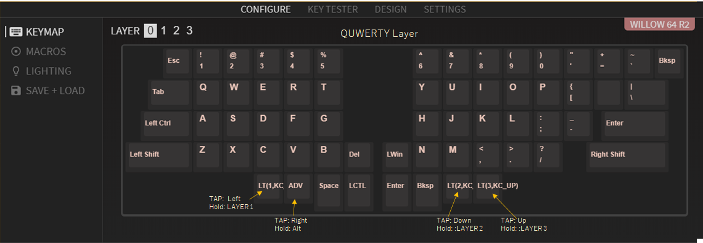
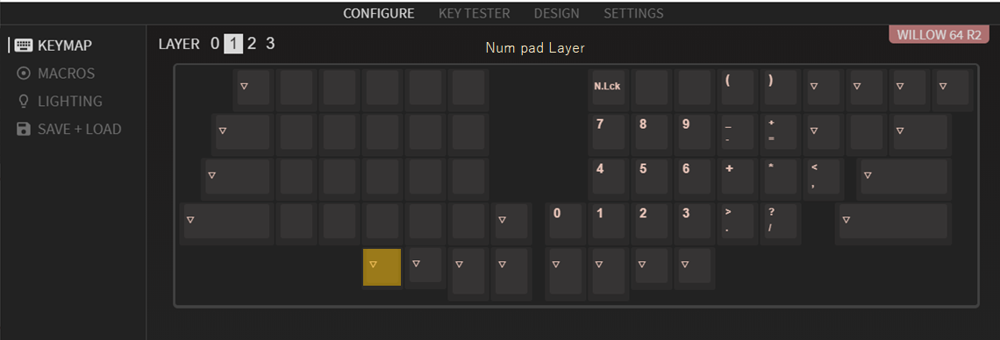
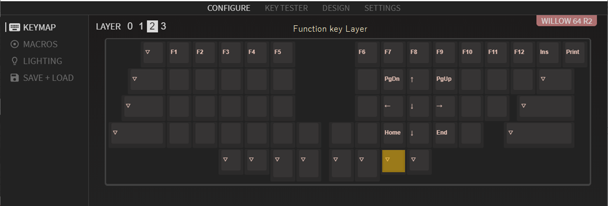
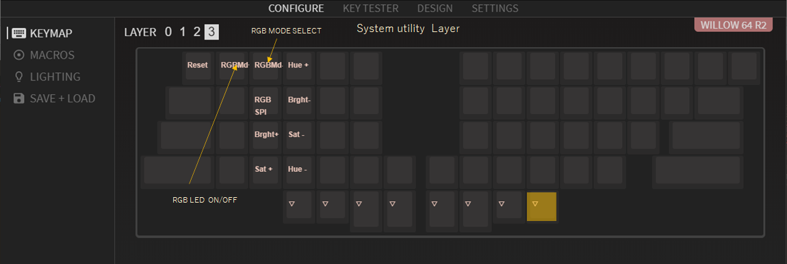

# Description about default keymap

### layer 0 -- QWERTY layer

  

### layer 1 -- Numpad layer

  

### layer 2 -- Function key layer

  

### layer 3 -- System utility layer

  

* * *
 ### VIA Enabled 
 'willow64_rev2_default.hex' has VIA enabeld.

- VIA is available here 
   
   - https://github.com/the-via/releases/releases/tag/v1.3.1
  
- VIA config file for willow64
  - https://github.com/hanachi-ap/willow64-doc/releases/download/releae01/VIA_keymap_wllow64.json

see also [ （初心者編）VIAを使ってキーマップを書き換えよう](https://salicylic-acid3.hatenablog.com/entry/via-manual)

### maniac
Keymap that the author regularly uses:
  - https://github.com/hanachi-ap/qmk_firmware/releases/download/rev02-1/willow64_rev2_hanachi_custom.hex
