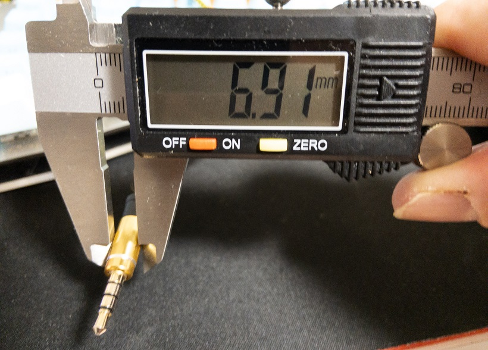
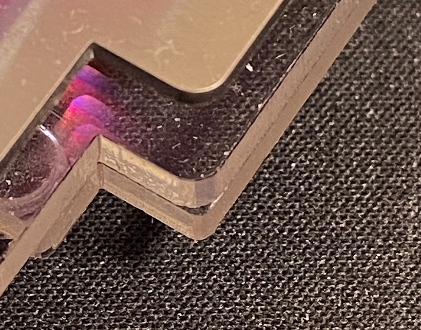

Willow64 Keyboard assembly kit Issue.

- 対象:
   - 型式  Willow64 assembly kit PCB R2 model SPA-1
   - 頒布時期  2020年12月 
   - 最終更新 2020/12/26 

- issue 01

  PCB裏面側ののProMicroコンスルーを挿入するホール周辺のメッキがありません。

  このためProMicroとPCBの接触が悪くなり導通しないピンが生じる恐れがあります。

  テスタで導通しないこピンが確認できた場合はコンスルーのピンを少し曲げるなどして接触を増やすようお願いします。
  
  

- issue 02

  TRRSケーブルのスリーブが太いものをご使用の場合、ケースと干渉してジャックに差し込めない場合があります。
 
  (現状確認できている範囲では、スリーブの直径6.9mmのケーブルは問題ありませんが、9.3mmのケーブルは干渉しています)
  
  

  

- issue 03
  
  右手側のアクリル製カバープレートの一部のコーナー丸め角(R)が、ボトムプレートと僅かに異なっている箇所があります。
  
  美観的な面以外には機能上の問題はありません。

  

